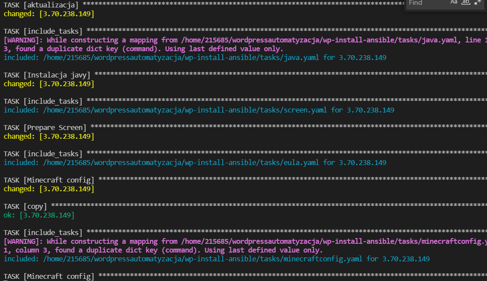
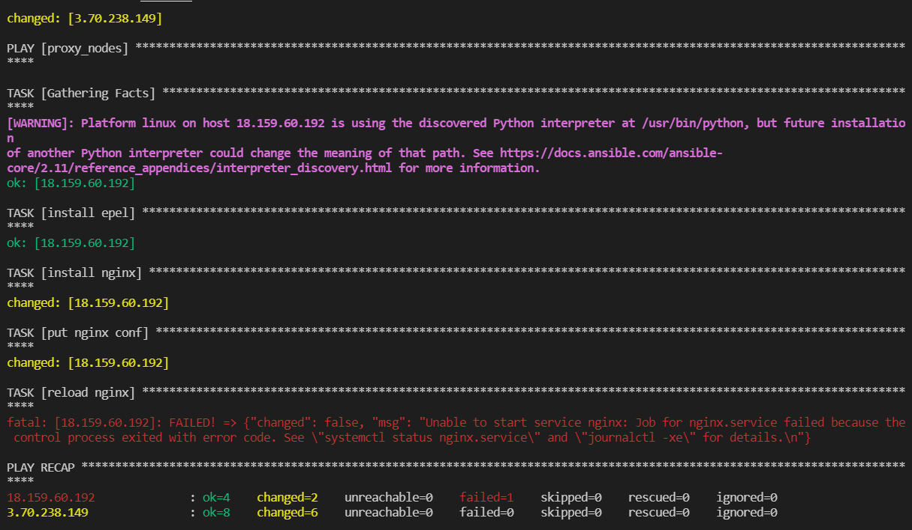
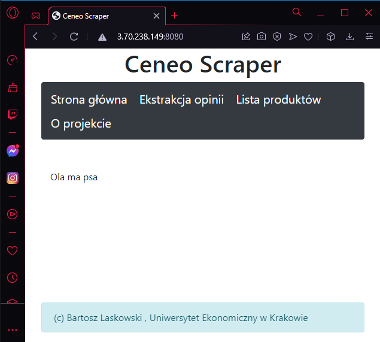

# AutoMC

1. Stworzenie pliku hosts.ini z adresami serwerów 
2. Stworzenie pliku setup_wp.yaml z instrunkcjami anisbla
3. Stworzeniu folderu wraz z taskami
4. Stworzenie aktualizacja.yaml wykonujący aktualizacje systemu
5. Stworzenie java.yaml instalujący odpowiednią wersję Java
6. Stworzenie screen.yaml instalujący screen
7. Stworzenie eula.yaml tworzący plik eula.txt z zawartością eula=true
8. Stworzenie pliku minecraftconfig.yaml z konfiguracją serwera
9. Wykonanie komendy: ansible-playbook -i hosts.ini setup_wp.yaml

####################

